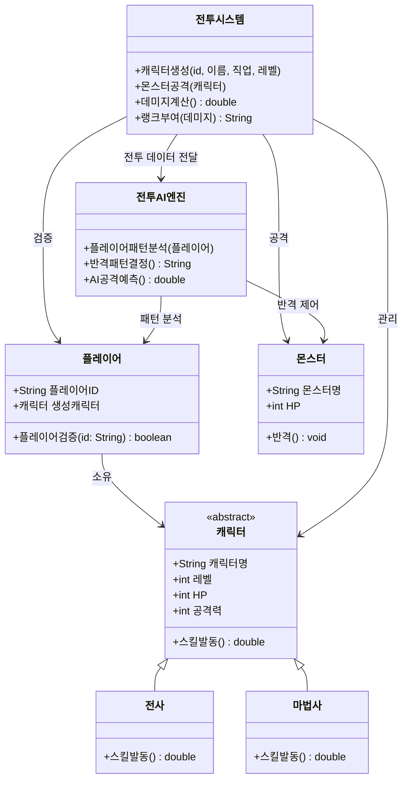

## AI 전투 시스템 Class Diagram

```mermaid
classDiagram

    class 플레이어 {
        +String 플레이어ID
        +캐릭터 생성캐릭터
        +플레이어검증(id: String) boolean
    }

    class 캐릭터 {
        <<abstract>>
        +String 캐릭터명
        +int 레벨
        +int HP
        +int 공격력
        +스킬발동() double
    }

    class 전사 {
        +스킬발동() double
    }

    class 마법사 {
        +스킬발동() double
    }

    class 전투시스템 {
        +캐릭터생성(id, 이름, 직업, 레벨)
        +몬스터공격(캐릭터)
        +데미지계산() double
        +랭크부여(데미지) String
    }

    class 전투AI엔진 {
        +플레이어패턴분석(플레이어)
        +반격패턴결정() String
        +AI공격예측() double
    }

    class 몬스터 {
        +String 몬스터명
        +int HP
        +반격() void
    }

    %% 상속 관계
    캐릭터 <|-- 전사
    캐릭터 <|-- 마법사

    %% 연관 관계
    플레이어 --> 캐릭터 : 소유
    전투시스템 --> 플레이어 : 검증
    전투시스템 --> 캐릭터 : 관리
    전투시스템 --> 몬스터 : 공격

    %% AI 연동
    전투시스템 --> 전투AI엔진 : 전투 데이터 전달
    전투AI엔진 --> 플레이어 : 패턴 분석
    전투AI엔진 --> 몬스터 : 반격 제어
```