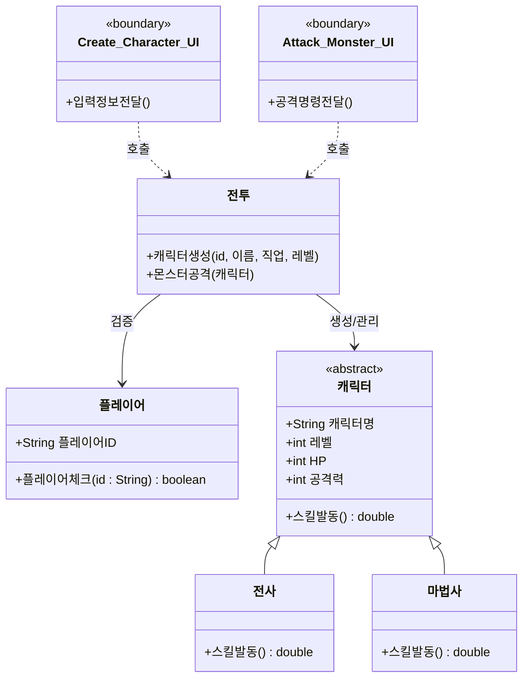

# Class Diagram

```mermaid
classDiagram

    class Create_Character_UI {
        <<boundary>>
        +입력정보전달()
    }

    class Attack_Monster_UI {
        <<boundary>>
        +공격명령전달()
    }

    class 플레이어 {
        +String 플레이어ID
        +플레이어체크(id : String) boolean
    }

    class 캐릭터 {
        <<abstract>>
        +String 캐릭터명
        +int 레벨
        +int HP
        +int 공격력
        +스킬발동() double
    }

    class 전사 {
        +스킬발동() double
    }

    class 마법사 {
        +스킬발동() double
    }

    class 전투 {
        +캐릭터생성(id, 이름, 직업, 레벨)
        +몬스터공격(캐릭터)
    }

    %% 상속 관계
    캐릭터 <|-- 전사
    캐릭터 <|-- 마법사

    %% 연관 관계
    Create_Character_UI ..> 전투 : 호출
    Attack_Monster_UI ..> 전투 : 호출

    전투 --> 플레이어 : 검증
    전투 --> 캐릭터 : 생성/관리
```