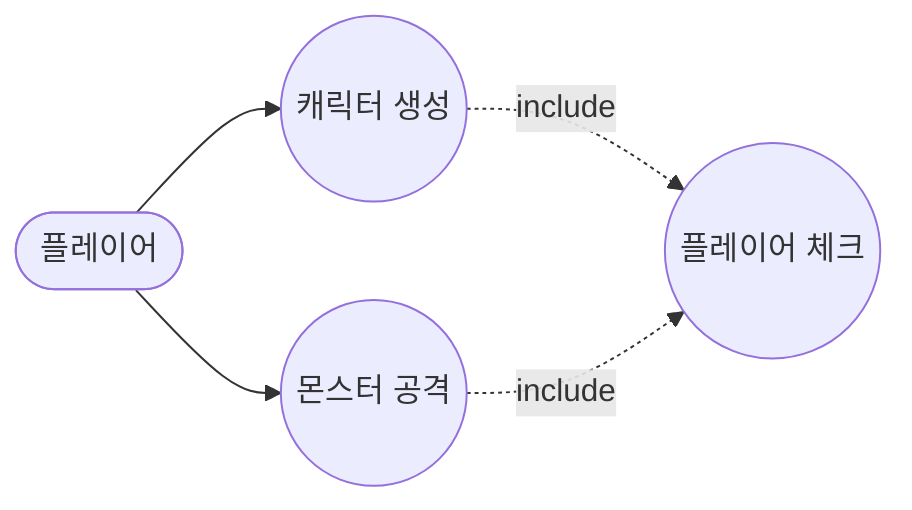

# Use Case Diagram

```mermaid
flowchart LR

    Player([플레이어])

    UC_Create((캐릭터 생성))
    UC_Attack((몬스터 공격))
    UC_Check((플레이어 체크))

    Player --> UC_Create
    Player --> UC_Attack

    UC_Create -. include .-> UC_Check
    UC_Attack -. include .-> UC_Check
```