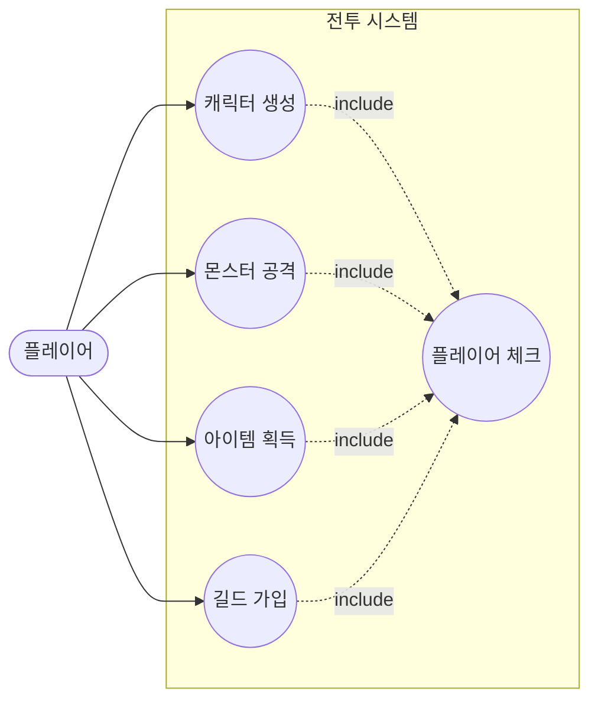

# Use Case Diagram

```mermaid
flowchart LR

    Player([플레이어])

    subgraph SYSTEM["전투 시스템"]
    
        UC_Create((캐릭터 생성))
        UC_Attack((몬스터 공격))
	UC_GetItem((아이템 획득))
        UC_JoinGuild((길드 가입))
        UC_Check((플레이어 체크))

        UC_Create -. include .-> UC_Check
        UC_Attack -. include .-> UC_Check
	UC_GetItem -. include .-> UC_Check
        UC_JoinGuild -. include .-> UC_Check

    end

    Player --> UC_Create
    Player --> UC_Attack
    Player --> UC_GetItem
    Player --> UC_JoinGuild
```