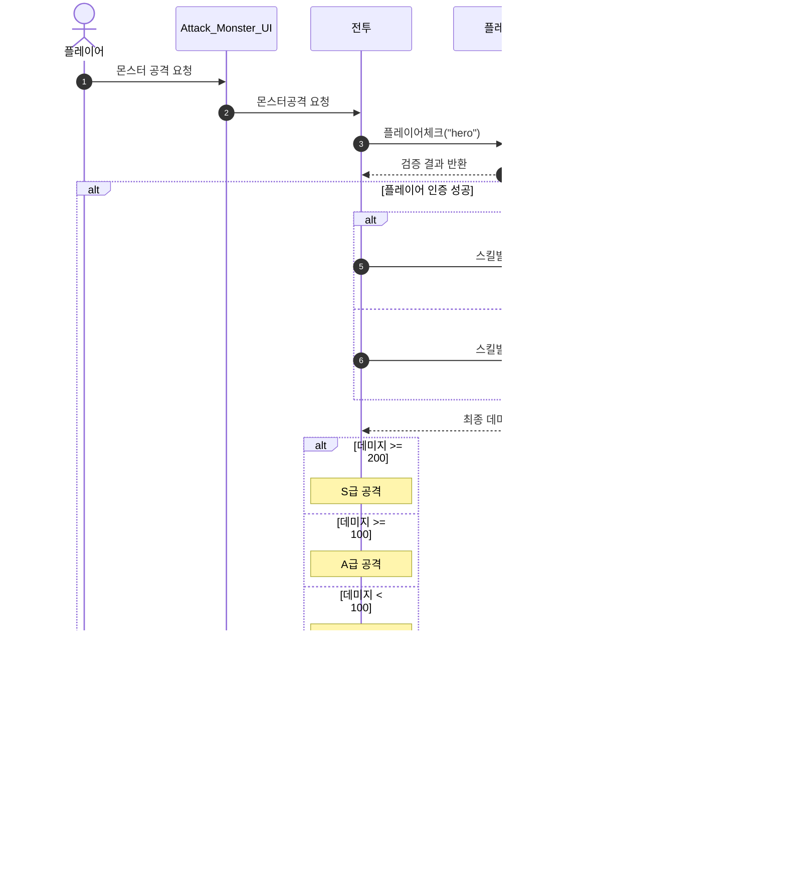

```mermaid
sequenceDiagram
    autonumber

    actor 플레이어

    participant 공격UI as Attack_Monster_UI
    participant 전투
    participant 플레이어관리 as 플레이어
    participant 캐릭터

    플레이어->>공격UI: 몬스터 공격 요청

    공격UI->>전투: 몬스터공격 요청

    전투->>플레이어관리: 플레이어체크("hero")
    플레이어관리-->>전투: 검증 결과 반환

    alt 플레이어 인증 성공

        alt 직업 == "전사"

            전투->>캐릭터: 스킬발동()
            Note over 캐릭터: "검 휘두르기!"\n데미지 = 공격력 * 1.5

        else 직업 == "마법사"

            전투->>캐릭터: 스킬발동()
            Note over 캐릭터: "파이어볼!"\n데미지 = 공격력 * 2.0

        end

        캐릭터-->>전투: 최종 데미지 반환

        alt 데미지 >= 200
            Note over 전투: S급 공격
        else 데미지 >= 100
            Note over 전투: A급 공격
        else 데미지 < 100
            Note over 전투: B급 공격
        end

        전투-->>공격UI: 공격 결과 반환

        공격UI-->>플레이어: 데미지 및 등급 출력

    else 플레이어 인증 실패

        전투-->>공격UI: 인증 실패

        공격UI-->>플레이어: "플레이어 인증 실패"

    end
```