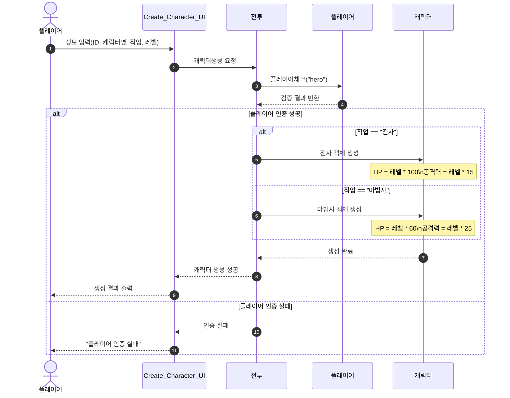

# Sequence Diagram - 캐릭터 생성

```mermaid
sequenceDiagram
    autonumber

    actor 플레이어

    participant 생성UI as Create_Character_UI
    participant 전투
    participant 플레이어관리 as 플레이어
    participant 캐릭터

    플레이어->>생성UI: 정보 입력(ID, 캐릭터명, 직업, 레벨)

    생성UI->>전투: 캐릭터생성 요청

    전투->>플레이어관리: 플레이어체크("hero")
    플레이어관리-->>전투: 검증 결과 반환

    alt 플레이어 인증 성공

        alt 직업 == "전사"

            전투->>캐릭터: 전사 객체 생성
            Note over 캐릭터: HP = 레벨 * 100\n공격력 = 레벨 * 15

        else 직업 == "마법사"

            전투->>캐릭터: 마법사 객체 생성
            Note over 캐릭터: HP = 레벨 * 60\n공격력 = 레벨 * 25

        end

        캐릭터-->>전투: 생성 완료

        전투-->>생성UI: 캐릭터 생성 성공

        생성UI-->>플레이어: 생성 결과 출력

    else 플레이어 인증 실패

        전투-->>생성UI: 인증 실패

        생성UI-->>플레이어: "플레이어 인증 실패"

    end
```